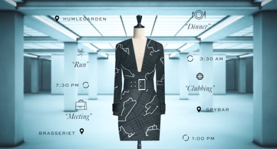

# Tema: Análisis de mercado de Ropa para Tallas Extra (Parte 4)

  ### Introducción:
 
 ### Por una publicidad (para tiendas de ropa) inteligente y efectiva basado en datos y análisis.

La obesidad y el sobrepeso han sido temas recurrentes en México durante décadas no se ha parado de exponer las complicaciones de salud que conlleva padecer dichas enfermedades, sin embargo, adentrándonos a la vida cotidiana de este nicho , es evidente que más problemas se han creado alrededor de ello.
  
Partimos de la importancia de dignificar el vestir de una persona con sobrepeso, en la industria de la confección. Este sector de la Moda se denomina de varias maneras, tanto como tallas especiales, tallas extras o tallas CURVI.
  
 ---
### Integrantes: 

- Evelyn Jocelyn Gonzalez Acevedo
- Axel Flores Guarneros.
- Marco Antonio Armas Santillán.
- Ariel Arturo Ríos Sierra.  
  
  
  ---
  
### Objectivos por módulos:
  
- [**`MODULO 1`**](https://github.com/Deltarios/analisis-ropa-bedu)
  Se busco encontrar una ubicación geográfica idónea y estratégica a nivel estatal para la apertura de nuevos establecimientos de esta índole.
  
- [**`MODULO 2`**](https://github.com/Deltarios/analisis_ropa_bedu_2)
  La creación de un concepto como una marca específica que se inserte en el mercado, ofertando  en una misma línea  “Marca y  Publicidad “
  Analisis de las ventas en linea de ropa
  
- [**`MODULO 3`**](https://github.com/Deltarios/analisis_ropa_bedu_3)
  Analisis de MUNICIPIO VS CANTIDAD DE PERSONAL VS DIMENSION DE TIENDA
  Ubicación de centros de distribución basada en una comparativa de las ubicaciones de una fábrica/almacen y  puntos de venta.
  
  ---
  
### Contenido del Repositorio:
  
 > NOTA: Los archivos **`.ipynb`** pueden tardar en cargar en github, reintentar abrir si marca error de lo contrario abrilos en [**`Colab by Google`**](https://colab.research.google.com/)

-  [**`Ropas_Extra_Parte_4.ipynb`**](proyecto/Ropas_Extra_Parte_4.ipynb)
   Utilizar un algoritmo no supervizado, analizando las variables de porcentaje de obesidad vs el valor comercial. Igualmente se aplico una redución de componentes principales, donde se realizo un análisis de codo y silueta para saber mediante K-Means para conocer el número de clushter ideal para agrupar las tiendas resumido en 2 dimensiones. [**`Ver en Colab Aquí`**](https://colab.research.google.com/drive/1ijQ4b2bzkBR8L0fxwIjlBBJ9l4N2nz7h?usp=sharing)
   
-  [**`Calculadora_de_Ropa.ipynb`**](proyecto/Calculadora_de_Ropa.ipynb)
   A partir de diferentes parametros definidos por el usuario precide tu talla ideal. [**`Ver en Colab Aquí`**](https://colab.research.google.com/drive/1DBrCrecVHtp5bWTubz1kuxK6utpxZ_yF?usp=sharing)
   
-  [**`Segmentar vestido.ipynb`**](proyecto/Segmentar%20vestido.ipynb)
   Para esta parte del proyecto realizaremos un Sistema Segmentador de Vestidos, que consiste en recibir como entrada imágenes de personas usando vestidos, y a partir de estás identificar que parte es el vestido, que parte es la piel, que parte es la persona y que parte es el fondo.
  Esto con el fin de que, una vez entrenado el modelo, a partir de cuaqluier imagen cargada se pueda identificar únicamente el vestido. [**`Ver en Colab Aquí`**](https://colab.research.google.com/drive/1AaCHDD5Ll1BkBOram96JneoSBhoeUSAV)
  
-  [**`Sistema de recomendación vestidos.ipynb`**](proyecto/Sistema%20de%20recomendación%20vestidos.ipynb)
   Para esta parte del proyecto, crearemos un sistema de recomendación de vestidos que consistirá en buscar vestidos similares con base en la selección de un vestido en específico, todo esto a través del análisis de imágenes. [**`Ver en Colab Aquí`**](https://colab.research.google.com/drive/1yj3rHjYmUjAMnVrVLj1xIpGovh9CgKT5)

-  [**` CLASIFICADOR DE ROPA_1.ipynb`**](proyecto/CLASIFICADOR_DE_ROPA_1.ipynb)
   En esta parte se buscara facilitar el proceso de alta de productos de manera automatizada en un punto de venta basando en una clasificación programada, mediante el procesamiento de imágenes y redes neuronales, permitiéndole al Usuario poder ordenar sus productos por categoría de manera autónoma. [**`Ver en Colab Aquí`**](https://colab.research.google.com/drive/1DqTnvllOYJosrBMAQBuCyC7cB28GCsar?usp=sharing#scrollTo=MhoQ0WE77laV)
  
**`Datasets`**
   
  Grupo de datasets utilizados en el proyecto (El código se llaman en red, pero se incluye los datasets de la información si se requieren).
  
-  [**`Segmentar vestidos`**](https://drive.google.com/drive/folders/1SnV_KbuCy49WOtdgTAbIAg-hiwY2HL6Q)
-  [**`Sistema recomendación de vestidos`**](https://drive.google.com/drive/folders/1gZV2V5KCdSSxVvSXHvkmTK68ANvJtIpq)
   
---
  
### Desarrollo: 

> NOTA: Esto es en modo de resúmen, dentro de los Scripts se encuentra explicado cada detalle de la obtención de la información.
  
#### _¿Cuáles son los pasos y objetivos de nuestro  estudio?_
  
  
  

- Mediante un estudio se encontrará la ubicación  geográfica puntual a nivel municipal para la apertura del establecimiento, asimismo encontrando puntos de publicidad para la  difusión del concepto de la Comercialización  de tallas extras.

- Tomar la opción que englobe todas las ventajas tanto para la parte comercializadora como para el consumidor en la creación de un concepto como una marca específica que se inserte en el mercado, y en los establecimientos ya aberturados que cuenten con mayor tiempo en el mercado y además con cierto prestigio, así ofertando en una misma línea "Marca y  Publicidad" lo que implicaría una reducción de costos.

- Selección puntual de la ubicación de la tienda
_(Para poder llevar a cabo estos dos puntos se procedió elegir un estado del Top 5 generado en el proyecto anterior para su análisis.)_
  
#### _SISTEMA SEGMENTADOR DE VESTIDOS_
Para esta parte del proyecto realizaremos un Sistema Segmentador de Vestidos, que consiste en recibir como entrada imágenes de personas usando vestidos, y a partir de estás identificar que parte es el vestido, que parte es la piel, que parte es la persona y que parte es el fondo.

Esto con el fin de que, una vez entrenado el modelo, a partir de cuaqluier imagen cargada se pueda identificar únicamente el vestido.

El principal desafió en este problema de segmentación estará en el ruido de las imágenes, ej. confundir el cabello con parte del vestido, accesorios que tengan las personas, fondos de colores poco contrastantes respecto al color del vestido, etc. Por ello, buscamos apoyarnos de distintos métodos que nos ayuden a procesar de mejor forma las imágenes.

Este segmentador es muy útil, ya que nos puede servir para identificar únicamente el vestido y en complemento al "Sistema de Recomendación de Vestidos" buscar vestidos similares al vestido original. ¿Pero porqué no simplemente utilizar la imágen de la persona completa? Porque para buscar la similitud de vestidos, necesitamos eliminar el ruido, es decir el entorno y a la persona misma, solo dejando el producto.

Y es muy versatil, ya que se pueden utilizar estos programas en una aplicación en la que solo tomas una foto con tu celular y te muestra todos los vestidos similares que se encuentran en determinada tienda.
  
#### _SISTEMA DE RECOMENDACIÓN DE VESTIDOS_

Para esta parte del proyecto, crearemos un sistema de recomendación de vestidos que consistirá en buscar vestidos similares con base en la selección de un vestido en específico, todo esto a través del análisis de imágenes.

Para esto, utilizaremos una de las bases de Zalando (empresa de venta de ropa en línea en Europa). En el Clasificador de Ropa ya utilizamos la base de datos Fashion-Mnist que consiste en un conjunto de imágenes en bruto de 10 categorías de ropa. Sin embargo, en esta ocasión utilizaremos otro conjunto de datos que es "Feidegger" que consiste en un conjunto de datos compuesto por imágenes y descripciones exclusivamente de Vestidos.
